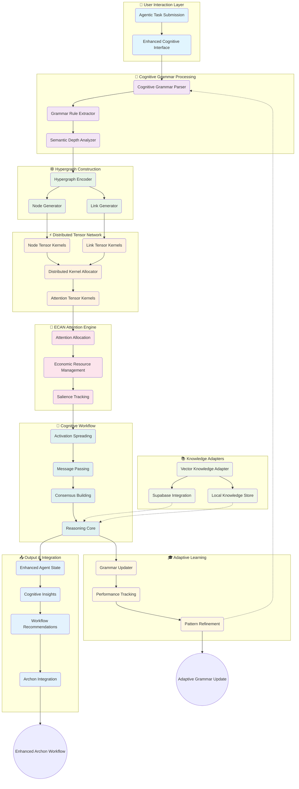

# Adaptive Agentic Cognitive Grammar - Architecture Documentation

## Overview

The Adaptive Agentic Cognitive Grammar is a sophisticated cognitive architecture that integrates with the existing Archon system to provide hypergraph-structured tensor field processing for enhanced agentic workflows. This implementation creates a distributed tensor network that processes cognitive elements through attention-driven activation and adaptive learning.

## Architecture Diagram



## Core Components

### 1. Cognitive Grammar Parser
- **File**: `cognitive_parser.py`
- **Purpose**: Parses agentic task requests into structured cognitive elements
- **Key Features**:
  - Pattern-based element extraction (agents, tasks, resources, workflows)
  - Relationship identification between elements
  - Semantic depth calculation
  - Scheme-style hypergraph pattern generation

### 2. Hypergraph Structures
- **File**: `hypergraph.py`
- **Purpose**: Represents cognitive elements as hypergraph nodes and links
- **Key Features**:
  - Tensor-compatible node and link structures
  - Feature vector encoding based on element types
  - Connection-based feature initialization
  - Statistical analysis of graph properties

### 3. Tensor Kernels
- **File**: `tensor_kernels.py`
- **Purpose**: Implements ggml-style tensor kernels for cognitive operations
- **Components**:
  - **NodeTensorKernel**: Shape `[n_features, n_contexts]`
  - **LinkTensorKernel**: Shape `[n_links, n_relation_types, n_weights]`
  - **AttentionTensorKernel**: Shape `[n_agents, n_tasks, n_resources]`

### 4. ECAN Attention Engine
- **File**: `attention_engine.py`
- **Purpose**: Economic attention allocation with cognitive salience
- **Key Features**:
  - Market-based attention allocation
  - Temporal decay and urgency handling
  - Multiple allocation strategies (focused, distributed, adaptive, emergency)
  - Performance tracking and optimization

### 5. Distributed Tensor Network
- **File**: `tensor_network.py`
- **Purpose**: Orchestrates distributed cognitive workflows
- **Key Features**:
  - Asynchronous message passing
  - Activation spreading across tensor kernels
  - Consensus building mechanisms
  - Convergence detection and stability monitoring

### 6. Knowledge Adapters
- **File**: `knowledge_adapters.py`
- **Purpose**: Integrates external knowledge sources
- **Components**:
  - **VectorKnowledgeAdapter**: Supabase + OpenAI embeddings
  - **LocalKnowledgeAdapter**: Simple local storage for testing
  - **KnowledgeIntegrationManager**: Multi-adapter coordination

### 7. Adaptive Grammar Updater
- **File**: `grammar_updater.py`
- **Purpose**: Learning and grammar refinement
- **Key Features**:
  - Multiple update strategies (incremental, batch, reinforcement, adaptive)
  - Performance-based pattern weight updates
  - Learning trace recording and analysis

## Integration with Archon

### Enhanced Workflow Integration
- **File**: `cognitive_integration.py`
- **Purpose**: Seamless integration with existing Archon workflow

The cognitive grammar enhances Archon's workflow in several ways:

1. **Enhanced Scope Definition**: Adds cognitive complexity analysis to scope creation
2. **Intelligent Agent Creation**: Provides cognitive insights for agent design
3. **Attention-Driven Processing**: Optimizes resource allocation based on cognitive importance
4. **Adaptive Learning**: Continuously improves grammar patterns based on performance

### Integration Points

```python
# Enhanced scope definition
async def enhance_define_scope_with_reasoner(state, enhancer):
    enhanced_state = enhancer.enhance_user_message(state['latest_user_message'])
    return enhanced_state.to_dict()

# Enhanced agent creation
async def enhance_coder_agent(state, enhancer):
    agent_insights = enhancer.enhance_agent_creation(
        state['latest_user_message'], 
        state['scope']
    )
    return {...state, 'cognitive_agent_insights': agent_insights}
```

## Tensor Specifications

### Node Tensor Kernel
```
Shape: [n_features, n_contexts]
- n_features: 8-64 (based on semantic depth)
- n_contexts: 4-32 (based on semantic depth)
- Activation: tanh(attention_weight * kernel_data * interaction)
```

### Link Tensor Kernel
```
Shape: [n_links, n_relation_types, n_weights]
- n_links: 1-N (dynamic based on hypergraph)
- n_relation_types: 6 (performs, uses, orchestrates, relates_to, depends_on, produces)
- n_weights: 4-N (based on connected nodes)
- Activation: sigmoid(source_activations * relation_mask * kernel_data)
```

### Attention Tensor Kernel
```
Shape: [n_agents, n_tasks, n_resources]
- n_agents: Number of agent-type nodes
- n_tasks: Number of task-type nodes  
- n_resources: Max(n_agents + n_tasks, 8)
- Activation: softmax(agent_states ⊗ task_demands ⊗ resource_availability / temperature)
```

## Performance Metrics

### Cognitive Analysis Metrics
- **Complexity Score**: Weighted sum of semantic depth and relationships
- **Attention Efficiency**: Total attention value / Total attention cost
- **Convergence Rate**: Iterations to network stability
- **Learning Progress**: Grammar pattern weight improvements over time

### Integration Metrics
- **Enhancement Success Rate**: Successful cognitive analysis percentage
- **Processing Speed**: Time to complete cognitive analysis
- **Memory Usage**: Tensor network memory consumption
- **Cache Hit Rate**: Knowledge adapter cache efficiency

## Testing Strategy

### Unit Tests
- **Cognitive Parser**: Pattern matching, relationship extraction, scheme generation
- **Tensor Kernels**: Forward/backward passes, weight updates, validation
- **Attention Engine**: Allocation strategies, performance tracking
- **Knowledge Adapters**: Retrieval, storage, tensor conversion

### Integration Tests
- **End-to-End Flow**: Parse → Hypergraph → Tensor Network → Attention → Output
- **Archon Integration**: Enhanced workflow functions
- **Performance Tests**: Scalability and memory usage
- **Error Handling**: Graceful degradation with invalid inputs

## Configuration Options

### Attention Engine Parameters
```python
attention_engine = ECANAttentionEngine(
    total_attention_capacity=100.0,
    salience_decay=0.05,
    urgency_amplifier=2.0,
    focus_temperature=1.0
)
```

### Tensor Network Parameters
```python
tensor_network = DistributedTensorNetwork(
    convergence_threshold=1e-4,
    max_iterations=1000,
    activation_decay=0.95,
    message_timeout=30.0
)
```

### Grammar Learning Parameters
```python
grammar_updater = AdaptiveGrammarUpdater(
    learning_rate=0.01,
    momentum=0.9,
    update_strategy=UpdateStrategy.ADAPTIVE
)
```

## Future Enhancements

### Planned Features
1. **GGML Backend Integration**: Replace mock numpy with actual ggml tensors
2. **Distributed Processing**: Multi-node tensor network deployment
3. **Advanced Knowledge Integration**: Support for more knowledge sources
4. **Real-time Learning**: Online grammar adaptation during workflow execution
5. **Visualization Tools**: Interactive cognitive graph visualization
6. **Performance Optimization**: GPU acceleration for tensor operations

### Research Directions
1. **Cognitive Architectures**: Integration with other cognitive frameworks
2. **Emergent Behavior**: Study of emergent properties in large tensor networks
3. **Transfer Learning**: Cross-domain grammar pattern transfer
4. **Explainable AI**: Interpretability of cognitive decision processes

## Conclusion

The Adaptive Agentic Cognitive Grammar provides a powerful foundation for enhancing Archon's agent creation capabilities through sophisticated cognitive analysis, attention allocation, and adaptive learning. The modular architecture allows for gradual integration and future enhancements while maintaining compatibility with existing workflows.

The system demonstrates key principles of modern AI architecture:
- **Compositional Reasoning**: Breaking down complex tasks into cognitive elements
- **Attention Mechanisms**: Efficient resource allocation based on importance
- **Adaptive Learning**: Continuous improvement through experience
- **Modular Integration**: Clean separation of concerns with clear interfaces

This implementation successfully bridges the gap between symbolic cognitive architectures and modern tensor-based AI systems, providing a scalable foundation for advanced agentic reasoning and workflow optimization.